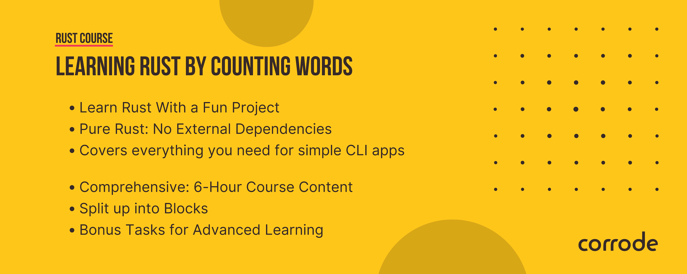

# Learning Rust by Counting Words

## Introduction

Learning Rust is hard. Some people learn best with a concrete project in mind.
This workshop is for people who want to learn Rust by building a small, usable
tool, that can be extended in many ways. We build `wc`, a little tool that
counts words, lines and characters in a file.

It sounds simple, but it's a great way to learn Rust. On the way, we'll cover
many important concepts like:

- I/O
- Error handling
- Parsing
- Testing
- Command line arguments
- Documentation
- And more!

> [!NOTE]
> `wc` already exists on most systems, but we'll build our own version from scratch.
> We will focus on idiomatic code and extensible design.

## Who's the Target Audience?

This workshop is intended for Rust *beginners* who are just starting out on
their Rust journey. You don't need to know Rust, but you should be familiar with
the basics of programming.

We will not use any dependencies outside of the standard library, so you 
will be able to follow along without having to install any additional tools.
Speaking of which...

### Necessary Tools

* [rust](https://www.rust-lang.org/tools/install)
* [git](https://git-scm.com/)

## Structure

Use `src/main.rs` to start writing your code. If you get stuck, check out the
[examples](/examples) folder, which contains working source code for each block.
We recommend to try it yourself first and only refer to the example code in case
you run into issues.

## Features We Cover

1. Counting words, lines and characters
2. Support for multiple files
3. Support for stdin

## Block 0 - Check Rust Installation

Run `rustc --version`.
You should see something like `rustc 1.74.0 (79e9716c9 2023-11-13)`.

## Block 1 - Count Words

Open `wc/src/main.rs` and start coding.

* Count words with the given path
* Get it to run
* Code quality doesn’t matter
* Bonus: refactor the code a bit
* Bonus: try a different programming paradigm (e.g. functional)

## Block 2 - Count Lines and Characters

* Also count characters
* Also count lines
* Bonus: Focus on code structure, readability, and extensibility

## Block 3 - Multiple Files and Stdin

* Accept multiple files as input
* Proper error handling with `Result`
* Bonus: Print the total count over all files at the end
* Bonus: support `stdin` (standard input), e.g. `cat file.txt | wc`

## Block 4 - Testing and Linting

* Add unit tests
* Lint your code with clippy
* Bonus: split your code into `lib.rs` and `main.rs`

## Block 5 - Idiomatic Rust (Discussion)

* What is idiomatic Rust?
* Discussing programming paradigms in Rust
* Functional vs. Imperative vs. OOP

## Block 6 - Performance

* Let's measure the performance of your code
* Criterion
* Flamegraphs
* Bonus: Try to improve the performance

## Choose Your Own Adventure

* Build a REST API around `wc`
* Add a new feature
* Improve the code
* Add documentation
* Make it faster
* Handle `wc /dev/zero`
* Release your package on crates.io

It's your choice! We're here to help you.

## Show And Tell!

We are curious to see what you have built. If you want to share your word
counter with us, please send us a link to your repository. We will add it to the
list below.

We'd be happy to hear your answers to the following questions:

- What did you learn?
- What was easy?
- What was hard?
- Would you do anything differently?
- What would you like to learn next?

## Closing Words

If you enjoyed this workshop, please share it with your friends and colleagues.
It would greatly help us if you could tweet/toot about it or share it on
[Reddit](https://www.reddit.com/r/rust/) or [LinkedIn](https://www.linkedin.com/).
Thanks!

You might also want to [subscribe to our newsletter](https://corrode.dev/blog/) for
future workshops and other Rust content.

If you are looking for professional Rust training, please get in touch with us
at [corrode.dev](https://corrode.dev/).
